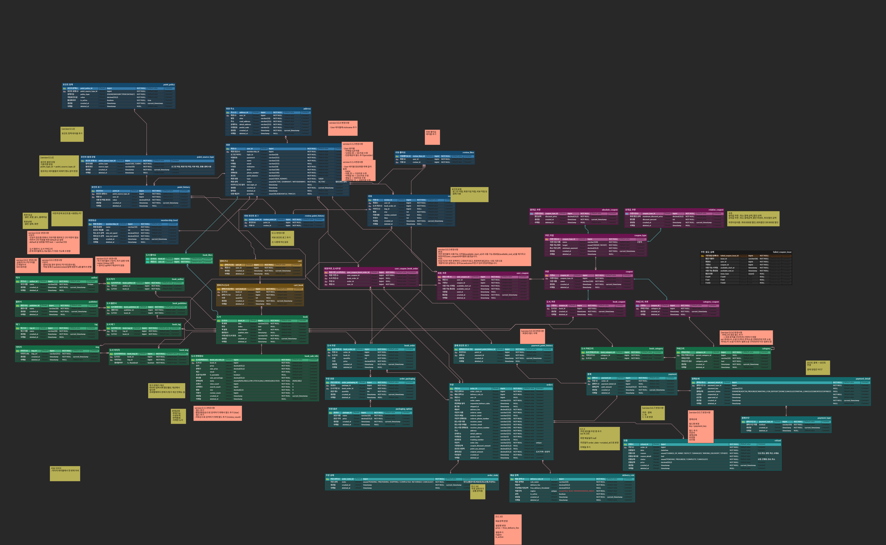
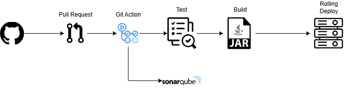
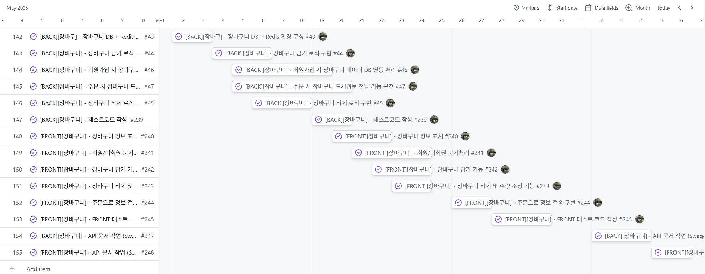

# 

## 📌 프로젝트 정보

- **프로젝트명**: 블루북틀 (BlueBooktle)
- **목적**: 도서를 검색하고 구매할 수 있는 온라인 서점 플랫폼 구현
- **기술스택**: Spring Boot, MySQL, Redis, Minio 등
- **개발 기간**: 2025.04.28 ~ 2025.06.13
- **웹사이트**: [https://bluebooktle.shop](https://bluebooktle.shop)

---

<h3 align="left">👥 팀 소개</h3>

<table>
  <tr>
    <td align="center">
       
      <b>박태희</b> 
      <a href="https://github.com/marf3927" target="_blank">@marf3927</a>
    </td>
    <td align="center">
       
      <b>신건수</b> 
      <a href="https://github.com/Shin-Gunsu" target="_blank">@gunsurius</a>
    </td>
    <td align="center">
       
      <b>이용준</b> 
      <a href="https://github.com/yoplenople" target="_blank">@yoplenople</a>
    </td>
    <td align="center">
       
      <b>문소연</b> 
      <a href="https://github.com/oonsy99" target="_blank">@oonsy99</a>
    </td>
  </tr>
  <tr>
    <td align="center">
       
      <b>손동훈</b> 
      <a href="https://github.com/sondonghun97" target="_blank">@sondonghun97</a>
    </td>
    <td align="center">
       
      <b>조수아</b> 
      <a href="https://github.com/chossa" target="_blank">@chossa</a>
    </td>
    <td align="center">
       
      <b>김재혁</b> 
      <a href="https://github.com/Combro-Kim" target="_blank">@Combro-Kim</a>
    </td>
    <td align="center">
       
      <b>이서인</b> 
      <a href="https://github.com/sslynn22" target="_blank">@sslynn22</a>
    </td>
  </tr>
</table>

---

## 📝 프로젝트 소개

**BlueBooktle**은 사용자에게 도서 검색부터 장바구니, 주문, 결제까지 전자상거래의 핵심 기능을 제공하는 통합형 온라인 서점입니다.  
Spring Boot 기반의 RESTful API를 중심으로 구현되었으며, MySQL, Redis, Minio 등을 활용해 백엔드 인프라를 구축했습니다.  
회원 인증, 포인트 적립/사용, 쿠폰 발급, 도서 찜, 리뷰 작성 등의 기능을 통해 실사용자 중심의 경험을 구현했습니다.

---

## 📦 개발 환경

- **IDE**: IntelliJ IDEA - Ultimate
- **언어**: Java 21 LTS
- **빌드 도구**: Maven
- **Spring Framework**: 5.3
- **Spring Boot**: 3.3.4
- **Spring Cloud Gateway**
- **Spring Cloud Netflix (Eureka)**
- **Spring Cloud Config**
- **Spring Cloud OpenFeign**
- **Spring Data / JPA / Redis / Elasticsearch**
- **QueryDSL**
- **MySQL**: 8.0.25
- **Redis**
- **Elasticsearch**: 8.6.2
- **JUnit 5 / AssertJ / Mockito**
- **SonarQube** (테스트 커버리지 80% 이상 유지)
- **ERD Cloud**
- **GitHub Project**
- **CI/CD**: GitHub Actions 기반, Continuous Integration & Delivery
- **Bootstrap 5**

## 🛠 Tech Stack

### 🖥 Language

### 💡 Framework & Library

### 🔧 Build Tool

### 🗄 Database

### ⚙ CI/CD

### ☁ DevOps & Infra

### 🧰 ETC

### 💻 Frontend

## 🧱 아키텍처 구조

---

## 🗃 ERD (DB 모델링)

---

## 🔄 CI/CD 파이프라인

---

## 🧪 테스트 & 커버리지

- SonarQube 커버리지 80% 이상 유지
- 단위 테스트(JUnit5, Mockito), 통합 테스트 포함

---

## 🗓 개발 일정 및 협업 방식

> GitHub Projects를 활용하여 전반적인 프로젝트 관리

### Scrum

- 시간
    - 매일 9:10 스크럼 미팅 진행
- 회의 내용
    - 어제/주말동안 진행한 내용 공유
    - 오늘 진행할 내용 공유
    - 진행하면서 발생한 장애물
    - 함께 의논할 사항

### 일정관리

- github WBS를 통한 전체적인 진행사항 관리
- 요구사항을 이슈로 작성해 역할 분담 후 일정 관리
  

- 백로그를 통한 현재, 그리고 진행사항을 볼 수 있도록 함

---

# 기능

## 손동훈

### 리뷰

- 리뷰 등록, 수정, 조회
- MinIO를 이용하여 리뷰 이미지 저장
- 별점 부여 가능 (1~5)
- 구매한 사람만 리뷰 작성 가능
- 책 조회 시 전체 리뷰 개수와 평점의 평균 함께 보여줌
- 마이페이지 리뷰 조회, 도서 상세페이지 리뷰 조회
- 리뷰의 좋아요 및 취소

### 도서

- 알라딘 API 연동해서 도서 정보 등록

## 이용준

### 장바구니

- Redis와 DB를 이용한 장바구니 상품 담기 기능 구현
- 비회원의 경우 Redis로 장바구니 상품 저장
    - 홈페이지에서 사용자의 고유 GUEST_ID 토큰 발행
- 회원의 경우 DB로 장바구니 상품 저장
    - DB에 저장을 하여 영구적으로 장바구니 정보 보유
- 비회원에서 회원으로 장바구니 정보 처리
    - 비회원 상태에서 장바구니 상품 선택 후 로그인 -> 기존 카트와 병합
    - 비회원 상태에서 장바구니 상품 선택 후 회원가입 -> DB로 전환

### 주문

- 주문 상태 백엔드 CRUD 기능 구현
- 배송 옵션 백엔드 CRUD 기능 구현

### 메인페이지

- 메인 페이지 표시 도서 작업
- 홈페이지에 표시될 도서 등록 작업
- Header 및 Footer 링크 작업

## 이서인

### 도서

- 도서 좋아요 백엔드 CRUD 기능 구현
- 도서 주문 백엔드 CRUD 기능 구현
- 주문 포장 백엔드 CRUD 기능 구현
- 포장 옵션 백엔드 CRUD 기능 구현
- 도서 상세 페이지 프론트 구현
- 마이페이지 도서 좋아요 프론트 구현
    - 로그인한 회원에게만 좋아요 버튼이 표시되도록 구현

### 관리자

- 포장 옵션 프론트 CRUD 기능 구현
- 도서 태그 프론트 CRUD 기능 구현
- 도서 출판사 프론트 CRUD 기능 구현

## 신건수

### 포인트

- 관리자 포인트 정책 수정 기능 구현
- 포인트 사용 / 적립 기능 구현
    - 포인트 적립과 회원가입/로그인 등의 트랜잭션을 분리하여 포인트 시스템에 문제가 발생하더라도 회원가입/로그인 기능은 안정적으로 동작하도록 보장합니다.

### 주문

- 회원/비회원 주문 및 조회 기능 구현
    - 주문시 배송날짜 지정
    - 주문 후 10분 동안 결제 미진행시 MQ - TTL + DLQ를 사용하여 주문 자동 취소
- 관리자 주문 관리 기능 구현
    - 배송 상태 변경 및 스케쥴링으로 배송중 -> 3일뒤 배송완료 처리
    - 배송 날짜 지정시 해당 날짜로 비교 후 배송 완료 처리
- 관리자 환불관리 프론트 페이지 추가
    - 관리자가 환불 거절 및 완료 입력
    - 환불 완료시 고객은 반품 배송비를 제외하고 결제 금액 만큼 포인트로 환불처리

## 김재혁

### 쿠폰

- 관리자 쿠폰 정책 및 쿠폰 생성 기능 구현
- 쿠폰 대상(전체 주문, 도서, 카테고리)에 따라 동적으로 발급 처리
- MQ 기반의 쿠폰 발급 기능 구현
    - RabbitMQ + Spring Batch를 이용해 생일 쿠폰, 직접 발급 쿠폰의 대량 발급 처리
    - ShedLock을 활용하여 스케줄링 중복 실행 방지
- 발급 실패에 대한 처리 구현
    - 발급 실패 시 DLQ로 분리
    - DLQ 메시지를 DB에 저장하여 관리자 재처리 가능하도록 구현

### 멤버십

- 매일 등급 자동 갱신 기능 구현
    - 매일 오전 3시에 스케줄러를 실행하여 최근 3개월 간 순수 결제 금액을 기준으로 멤버십 등급 자동 갱신

## 조수아

### 도서

- 도서 관련 CRUD 기능 구현(출판사, 작가, 태그, 카테고리)
- 도서 CRUD 기능 구현
- 위즈윅 에디터 연결 및 MinIO를 이용한 이미지 CRUD 구현
- 도서 CRUD 프론트 구현
- 도서 전체보기 및 카테고리 도서 목록 구현

### 캐싱

- 메인페이지 Redis을 이용해 카테고리 캐싱

### 검색

- Elastic Search를 활용하여 검색 기능 구현
    - 동의어, 유의어 검색 기능
    - 키워드(책 제목, 작가, 출판사, 태그 등) 검색 기능
    - 카테고리 도서 검색 기능
    - 도서 정렬(인기도, 최신순, 최저가, 최고가, 평점순, 리뷰순) 기능

### DBA

- MySQL 스키마 및 ERD 버전 관리

## 문소연

### 도서

- 도서 관련 CRUD 기능 구현(작가, 이미지)

## 박태희

### 프로젝트 구조 및 CI/CD

- 멀티모듈 프로젝트 초기 구조 설계 및 구축
- GitHub Actions를 이용한 CI/CD 파이프라인 설정 (빌드, 테스트, 배포 자동화)
- Jacoco, SonarQube를 연동하여 테스트 커버리지 리포트 자동화

### 인증/인가 (Auth)

- 아이디/비밀번호 기반의 회원가입 및 로그인 기능 구현
- JWT(RefreshToken)와 Redis를 활용한 토큰 재발급 및 블랙리스트 관리 기능 구현
- Payco 소셜 로그인 기능 추가
- API 엔드포인트별 인가 처리 및 토큰 검증 로직 구현

### 회원

- 회원, 주소, 등급 Entity 설계 및 공통 모듈화
- 회원 정보 조회, 수정, 탈퇴, 휴면 처리 기능 구현 (Front, Back)
- 관리자 페이지 회원 관리 기능 구현
- 회원 개인정보 암호화 처리

### 주문/결제

- 회원 및 비회원 주문 생성 및 결제 기능 구현
- 포인트 결제 로직 추가 및 결제 취소 API 구현

### 프론트엔드 및 공통

- 공통 컴포넌트 개발
- 화면 디자인 및 목업 UI/UX 개발
- 공통 에러 처리 로직 구현

## 팀원 공통

- database ERD 설계
- Test Code 작성
